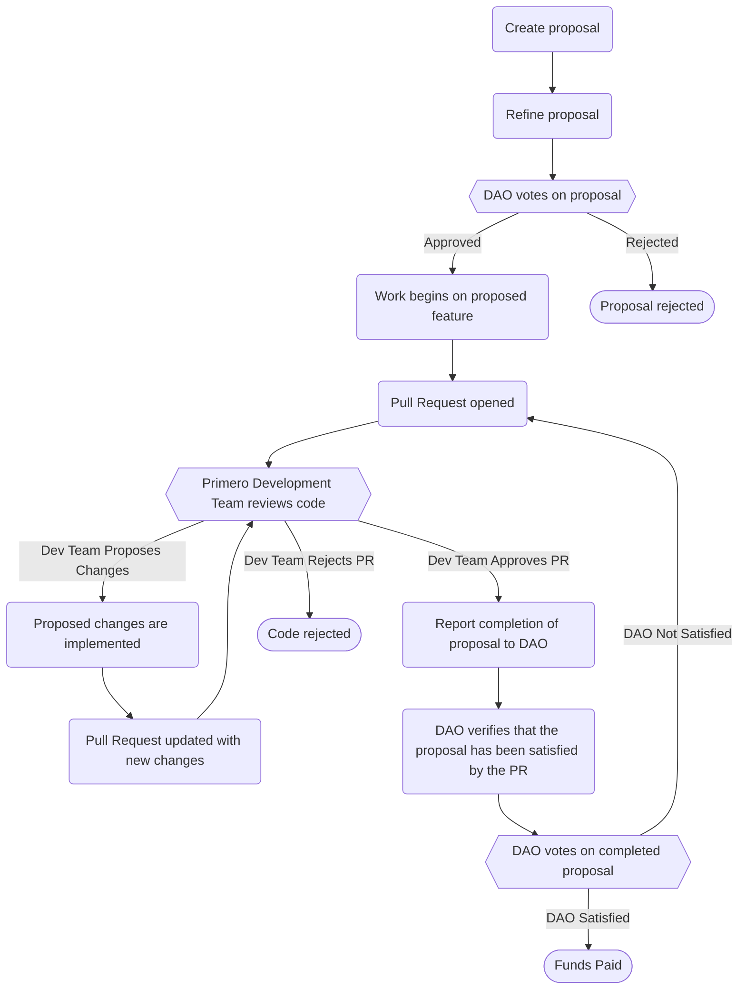

# Contributing as part of the DAO

When contributing to Primero, either as part of the DAO, or as a traditional open-source contribution, it is necessary to follow a set of guidelines. This helps ensure that any new contributions meet existing code standards, and are as likely as possible to be merged into the upstream repository.

In these instructions, we walk through the steps that are required to add a new feature to Primero.

If you are contributing as part of the DAO, you first need to create a proposal, which will be voted upon by the DAO members for approval. 

You will then work on your feature and submit a Pull Request to the Primero GitHub Repository.

> [!WARNING]
> Even if your proposal is approved by the DAO, it is still subject to code review by the Primero development team. This is a mandatory step, and you will not receive any payout if you do not pass code review. The Primero development team is not obligated to accept any proposed changes, even if the DAO has approved the proposal.

The following flow chart illustrates the overall process for contributing via the DAO and receiving payment for the associated work.

# Creating a Proposal

The forum for submitting proposals is located at: https://unicef.tomars.co/

You can see the guidelines for creating a proposal at the following thread: [link](https://unicef.tomars.co/t/how-to-doc-learn-how-to-propose-your-project/11)

Once you have crafted a proposal and it has been refined and approved, you should set up a development environment if you have not already done so. You can get started by following this guide: [Getting Started with Development Environment & Running Primero](Getting%20Started%20with%20Development%20Environment%20&%20Running%20Primero.md)

Once you have started work on your feature, you should open a PR by following the steps in: [Managing Git & Formatting PRs](Managing%20Git%20&%20Formatting%20PRs.md)
