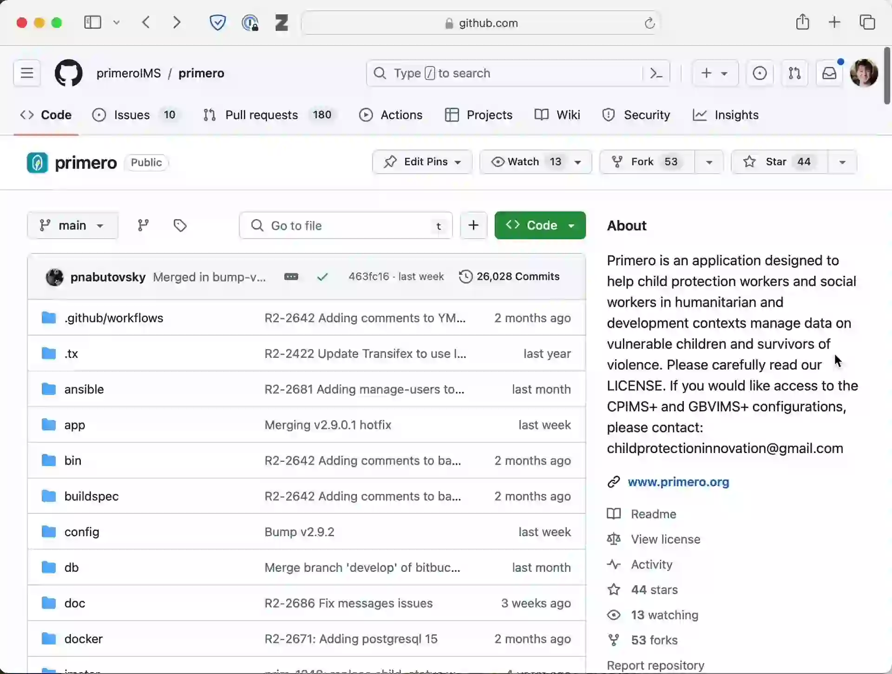

# Managing Git for Primero

As part of the process for contributing to Primero, it is necessary to maintain a specific workflow for using Git and GitHub.

You should initially create a fork of Primero on GitHub. If you are working on Primero as part of an organization, there might already be an existing fork on GitHub.


Once you have created a fork, you should add your fork as a remote destination to your local copy of the primero code.

Initially, you should create a branch with a descriptive name which identifies the feature you are working on, and push the branch to your fork of Primero hosted on GitHub.

```bash
git checkout develop
git pull
git remote add fork https://github.com/<YOUR GITHUB USERNAME>/primero.git
git fetch fork
git checkout -b my-branch-name
git push --set-upstream fork my-branch-name
```

## Creating a Pull Request

Once you are ready to have your contribution reviewed by the core development team, you should open a Pull Request on the Primero repository. The development team will then review the contribution, and suggest changes. Once you implement those changes, the team will review the contribution again, and either the review process will continue, or the changes will be approved for merging. Once the changes are merged, and the contribution is concluded, you will be able to ask for payment from the DAO.

Please include the string "DAO" in the pull request title and a link to the proposal pitch from the [UNICEF DAO discussion forum](https://unicef.tomars.co/c/pp/) in the pull request description. We will not merge pull requests that have not been approved by the DAO voting members. This ensures that developers are fully compensated for the pull requests submitted through the DAO.

If your contribution is not ready, but you need a place to discuss the changes you are making, you can make a pull request, and mark it as a draft.

Over time, as code is merged into Primero whilst your PR is pending, your PR will become stale. You should periodically merge in the most recent changes on the develop branch to ensure that there are no conflicts and that your code remains up-to-date. **You must always merge upstream changes, do not rebase.**

# Pull Request Checklist

If all of the following are not true, it is unlikely that the proposed PR will be accepted. With prior agreement from the Primero development team, it is possible to waive some of these requirements, but this agreement should be sought before embarking on a new feature.

Even if all of the requirements in the checklist are met, the code is still subject to in-depth review by the Primero development team, who hold ultimate authority regarding what code is merged. You should expect that the development team will suggest changes multiple times during the code review process.
## Backend Checklist
- [ ] RuboCop is passing without warnings on all changed Ruby files
- [ ] No new Ruby dependencies have been added to Gemfile
- [ ] Solr is not used within any new code
- [ ] Unit tests exist and pass for any new Ruby code
- [ ] Any new Ruby code has been checked for database queries. Excessive or complicated queries will result in performance issues for Primero. Especially be on the lookout for the [N + 1 queries problem](https://guides.rubyonrails.org/active_record_querying.html#n-1-queries-problem).
- [ ] There are no outstanding performance issues with the backend code
## Frontend Checklist
- [ ] ESLint is passing without any warnings on all changed JavaScript files
- [ ] No new JavaScript dependencies have been added to package.json
- [ ] Unit tests exist and pass for any new JavaScript code. Unit tests have been written taking [this document](https://github.com/primeroIMS/primero/blob/main/doc/ui_testing.md) into account
- [ ] Any application state is handled with Redux
- [ ] The [UI/UX guidelines](https://github.com/primeroIMS/primero/blob/main/doc/ui_ux.md) have been taken into account
- [ ] Any new frontend features have been tested on multiple screen sizes, including mobile devices

## Internationalization Checklist
- [ ] Any new strings which will be user facing are not literals in the code, but are referenced correctly using the internationalization features
- [ ] Translation files for languages other than English have not been updated as these will be overwritten by Transifex
- [ ] Any changes in the UI have been tested in both left-to-right and right-to-left languages for things like padding errors
## Non-Technical Checklist
- [ ] No vendor-specific dependencies have been added, such as integration with a particular vendor's cloud service or public API
- [ ] I understand that this PR may be rejected for any reason, and that having had a proposal approved in the DAO does not guarantee that my code will be merged