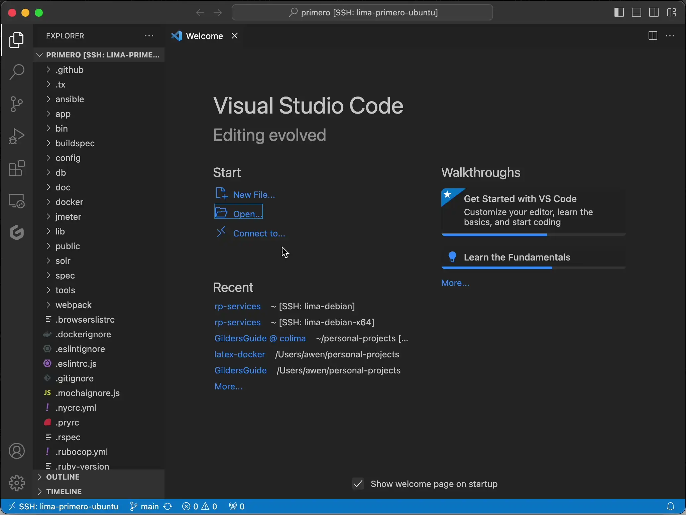
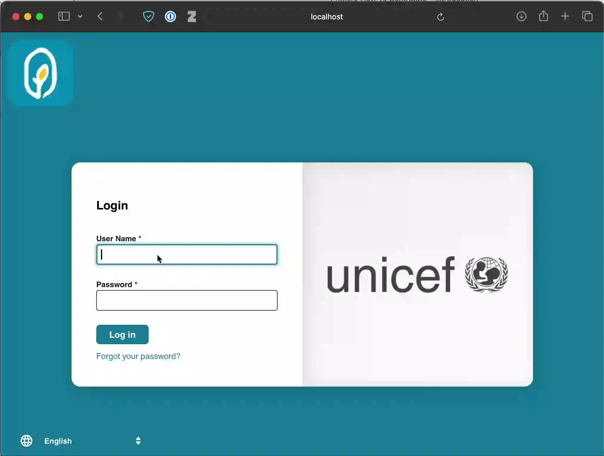

# Development Environment

> [!NOTE]
> If you are already an experienced Rails developer and are familiar with Docker, grab a copy of the code from [github](https://github.com/primeroIMS/primero) and skip to the section [Building the Containers](#building-the-containers).

In order to contribute to Primero, you need a working development environment. It is recommended to use a Mac or Linux operating system. If you are developing on Windows, you should consider using WSL or a VM.

The instructions in this guide assume that you are running Ubuntu Linux. Primero supports both x86_64 and arm64 architectures, so if you're using an M1 Mac or another arm64 machine like a Raspberry Pi, you don't need to do anything special. If you are using a different Linux distribution or MacOS, you will need to adapt the instructions accordingly.

## Cloning the Primero Repository

To get a fresh copy of the code, you need to have [git](http://git-scm.com/book/en/v2/Git-Internals-Packfiles) installed.

```bash
sudo apt update
sudo apt install git
```

Navigate to a directory in your shell where you would like to download Primero, and clone the repository.

```bash
git clone https://github.com/primeroIMS/primero.git
```

As most of the time you will be targeting the `develop` branch, you should switch to that branch now.

```bash
cd primero
git checkout develop
```

## Opening Primero in Visual Studio Code

> [!NOTE]
> Visual Studio Code is not required.
>
> If you prefer another IDE or editor, such as RubyMine, Vim, or Emacs, these instructions don't apply to you, but you will still want to make sure that you have any Ruby and Rails language features enabled.

If you do not already have Visual Studio Code, install it from <https://code.visualstudio.com>.

Click the *Open...* button in the middle of the window. Select the directory where you cloned Primero.



### Installing VSCode Extensions

> [!NOTE]
> This step is entirely optional.
>
> How you use your editor is up to you! There are a number of extensions that help with ruby support in VSCode.

You will want to install a few VSCode extensions to have the best experience editing Primero's code.

Shopify provides Ruby language support for VSCode. This extension is relatively new, and can occasionally be unstable (though this situation has improved recently). However, it is still the leading language support extension for Ruby, as the previous Ruby extension has been deprecated.

VS Marketplace Link: [ruby-lsp](https://marketplace.visualstudio.com/items?itemName=Shopify.ruby-lsp)

If you want to use the debugging features of VSCode for Ruby, you can add the following configuration to your `.vscode/launch.json`.

```json
{
    "version": "0.2.0",
    "configurations": [
        {
            "type": "ruby_lsp",
            "request": "launch",
            "name": "Run Rails Server with Debugger",
            "program": "${workspaceRoot}/bin/rails server"
        },
        {
            "type": "ruby_lsp",
            "request": "launch",
            "name": "Debug current spec",
            "program": "rspec -I ${workspaceRoot} ${file}"
        }

    ]
}
```
# Installing Dependencies
## Installing Ruby using `rbenv`

> [!NOTE]
> If you already have a solution that you like, such as rvm, asdf, or RTX, there is no reason to switch. You will just need to use them to install the correct runtimes.

> [!WARNING]
> The version of rbenv packaged with Ubuntu and Debian is out-of-date. You will need to install it according to the steps below, rather than use the version provided by apt.

`rbenv` is a version manager and installer for ruby runtimes. It allows you to install the correct version of ruby for each project that you are working on.

In order to install ruby using `rbenv`, you will need to install the following dependencies, which are used to build ruby from source.

```bash
sudo apt install curl g++ gnupg2 gcc autoconf automake bison libc6-dev libffi-dev libgdbm-dev libncurses5-dev libsqlite3-dev libtool libyaml-dev make pkg-config sqlite3 zlib1g-dev libgmp-dev  libreadline-dev libssl-dev
```

You will then need to install `rbenv` as well as `ruby-build`. There is a convenience script provided by `rbenv` that will help to install them.

```bash
curl -fsSL https://github.com/rbenv/rbenv-installer/raw/HEAD/bin/rbenv-installer | bash
```

The convenience script does not modify your `.bashrc` file. You need to update it manually with the snippet below. If you use another shell such as zsh, you will need to edit the correct startup file.

```bash
echo 'export PATH="$PATH:~/.rbenv/bin"' >> ~/.bashrc
echo 'eval "$(rbenv init -)"' >> ~/.bashrc
```

In the Primero top-level directory, there is a file `.ruby-version`, which contains the correct version of ruby to install. Install the correct version as follows:

```bash
cat .ruby-version
# This will print something like: ruby-3.3.5
# rbenv needs the version number, but not the ruby- prefix.
rbenv install 3.3.5 # replace 3.3.5 with whatever version is in .ruby-version
```

It will take several minutes to build and install ruby, depending on the speed of your machine.
Once you have succeeded in installing ruby, it is worth checking that you are now using the right version.

```bash
ruby --version
# This should print something like: ruby 3.3.5 (or whatever the current version in the .ruby-version is)
```

## Installing node using `nvm`

>[!note]
>Like rbenv, nvm is a version manager which will manage node installations on your machine. If you already have an alternative tool for managing node versions, you can use that instead. Simply get a copy of the LTS version of node and you should be good to go.

`nvm` is a version manager for node runtimes. It is similar to rbenv, but manages node rather than ruby.

`nvm` has a convenience script which will install it automatically. It should also automatically update your shell startup file.

```shell
curl -o- https://raw.githubusercontent.com/nvm-sh/nvm/v0.39.7/install.sh | bash
```

In order to start using `nvm`, you will need to close and reopen your terminal.

To install the version of node needed by primero, run the following command:
```shell
nvm install --lts
```
## Installing Docker and docker-compose

> [!NOTE]
> If you already have docker and docker-compose, skip this step.
>
> Docker can be installed in a number of different ways. As we are primarily using docker as a convenient way of running a database locally, it doesn't matter how it is installed.

Install docker using [apt](https://docs.docker.com/engine/install/ubuntu/#install-using-the-repository):
```bash
sudo apt install docker.io docker-compose-plugin
```
## Building the Containers

```bash
cd ./docker
sudo ./build.sh postgres solr
```
## Configuration file

Before running the containers, make sure to copy the sample environment file to create the necessary `local.env` file. This file is required when using `compose.local.sh up`.

```bash
cp local.env.sample.development local.env
```
## Running the Containers

You should run this from inside the docker directory.
```bash
sudo ./compose.local.sh up -d postgres
```
If you want to use **SOLR**, you can enable it by setting the environment variable `SOLR_ENABLED=true` before running the containers.

> **Note:** By default **SOLR** service is disabled, but it is still required to enable **FTR, GBV** and **KPI** features.

```bash
export SOLR_ENABLED=true
sudo ./compose.local.sh run solr make-primero-core.sh primero-test
sudo ./compose.local.sh up -d solr
```

## For more docker instructions

For detailed Docker setup instructions, see the [Docker README](docker/README.md).

# Configuring Primero for Local Development

Primero is partially configured with a number of yaml files. There are example versions of these files provided for local development. They need to be copied to the correct locations in order for Primero to function.

Execute these from the root directory of the repository. You may want to review these files and potentially make changes to them once they have been copied.
```bash
cp config/database.yml.development config/database.yml
cp config/locales.yml.development config/locales.yml
cp config/mailers.yml.development config/mailers.yml
mkdir log
```

If you are using SOLR enabled, you must copy sunspot file

```bash
cp config/sunspot.yml.development config/sunspot.yml
```

You will also need to install some system-wide dependencies required to build and run Primero.

```bash
sudo apt install libpq-dev imagemagick libsodium-dev p7zip
```

Execute the following to install Primero's ruby and node dependencies:

```bash
bundle install
npm ci
```

You now need to create the two Postgres databases (the default database, and a database used for unit testing).

```shell
rails db:create
rails db:migrate
rails db:seed

RAILS_ENV=test rails db:migrate
```

You also need to generate the translation files.

```shell
rails primero:i18n_js
```

Finally, you need to set a number of environment variables which contain necessary secrets.

The environment variables are:
- PRIMERO_SECRET_KEY_BASE
- DEVISE_SECRET_KEY
- DEVISE_JWT_SECRET_KEY

The following bash command will generate a secure secret for each of these and add them to your `~/.bashrc`:

```bash
for v in PRIMERO_SECRET_KEY_BASE DEVISE_SECRET_KEY DEVISE_JWT_SECRET_KEY;
do echo "export ${v}=$(openssl rand -hex 16)" >> ~/.bashrc;
done;
```

If you use a different shell, for example zsh, you will need to add these to the correct startup file.

# Running Unit Tests

To make sure that your system has been configured correctly, and to establish a baseline of the unit tests passing on your environment, it is a good idea to run the unit tests before making any changes to the Primero code. This may take a few minutes. On a VM with 4GB of RAM, it will take approximately 5 minutes to run the tests.

Ruby/Rails unit tests:

```shell
rspec spec
```

Javascript/NPM unit tests:
```shell
npm run test
npm run test:components
```


There should be no failures in the unit tests on a clean clone from the `develop` branch or main branch.
# Running Primero Locally

For this, you will want to create two different terminal tabs/windows. In one, run the following, which will build and serve the frontend application:

```shell
npm run dev
```

In the other window, run the following command, which will run the rails server that hosts the Primero backend.

> **Note:** If `SOLR_ENABLED` variable is set to true, primero will use solr service.

```bash
rails s
```

Visit http://localhost:3000/ in your browser, and you should see the following page. Note that it can take a while to load for the very first time, as the frontend application bundle needs to be compiled. Because of this, it is easiest to leave the `npm` process running in the background if you are only making changes to the backend code.

Log in using the default credentials `primero/primer0!`.




The version of Primero you will have configured by default is largely the same as CPIMS+. If you need a different configuration of Primero, for example, GBVIMS+, you will need to contact UNICEF and request access to the official configurations repository.

# Running Linters - RuboCop & ESLint

Primero uses two linters, RuboCop for the Ruby code, and `ESLint` for the JavaScript code.

Linting is enforced by the development team for all files in the `app` directory. You should run the linters and fix any errors before making a Pull Request, and ideally before every commit. There are tools such as [pre-commit](https://pre-commit.com) that can automatically do this for you, but their use is outside the scope of this guide.

To invoke RuboCop on all files in the `app/` directory:

```shell
rubocop -c .rubocop.yml app
```

To invoke RuboCop on a specific file, and auto-fix where possible:

```shell
rubocop -c .rubocop.yml -A <PATH TO FILE.rb>
```

To invoke RuboCop on all relevant files changed on your local branch:

```bash
git diff --cached origin/develop --name-only | grep -e "\.rb$" | grep -wv "db/*" | xargs rubocop -c .rubocop.yml
```

To run ESLint:

```bash
npm run lint
```


# Using WebPush

> [!NOTE]
> WebPush is only required if you are working on the WebPush feature. If you are not, you can skip this section.

To use the push notification features of Primero, you must set some environment variables: `PRIMERO_WEBPUSH`, `PRIMERO_WEBPUSH_CONTACT`, `PRIMERO_WEBPUSH_VAPID_PRIVATE` and `PRIMERO_WEBPUSH_VAPID_PUBLIC`.

To generate a valid VAPID keypair, you can execute the following script to generate private and public keys for their respective environment variables. You will probably want to add the variables to your `~/.bashrc` file.

```bash
  openssl ecparam -genkey -name prime256v1 -out private_key.pem
  # generating public_vapid_key
  openssl ec -in private_key.pem -pubout -outform DER|tail -c 65|base64|tr -d '\n'|tr -d '=' |tr '/+' '_-'
  # generating private_vapid_key
  openssl ec -in private_key.pem -outform DER|tail -c +8|head -c 32|base64|tr -d '\n'|tr -d '=' |tr '/+' '_-'
  rm private_key.pem
```

```bash
export PRIMERO_WEBPUSH="true"
export PRIMERO_WEBPUSH_CONTACT="your_email_goes_here@example.com"
export PRIMERO_WEBPUSH_VAPID_PRIVATE="private_key_generated_above_goes_here"
export PRIMERO_WEBPUSH_VAPID_PUBLIC="public_key_generated_above_goes_here"
```
